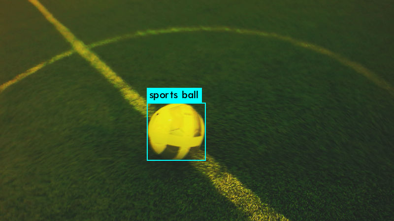

# Détection de ballon

## Auteurs:

-   [Aymane Lamhamdi](Aymane.Lamhamdi@enseirb-matmeca.fr)
-   [Ahmed-Manaf Dahmani](Ahmed-manaf.Dahmani@enseirb-matmeca.fr)
-   [Yoan Nguyen Van Ho](yoan.nguyen_van_ho@bordeaux-inp.fr)

## Objectif:

Ce projet est développé dans le cadre de la Robocup, l’objectif est de créer un algorithme de traitement d’images capable de reconnaître et de détecter la balle sur un terrain de foot. 

## Algorithme de vision

Le pipeline de l'algorithme de vision est constitué comme suit :

- D'abord l'image est convertie en HSV pour permettre d'égaliser la saturation vue que les couleurs dans les images sont très jaunâtres
- Nous en profitons pour utiliser la Hue pour faire un masque qui sélectionne le terrain et faire une bounding box. Cela permet de recarder l'image ensuite pour éliminer le background.
- Une fois l'image égalisée et recadrée obtenue, nous la convertissons en niveaux de gris pour pouvoir faire de la détection de contour. Nous en profitons pour appliquer un flou gaussien pour éliminer le bruit que les herbes pourraient générer sur la détection de contour.
- En suite, l'algorithme de Canny est utilisé pour détecter les contours, suivit d'une dilatation pour accentuer ces contours.
- Enfin, l'algorithme de Hough est utilisé pour détecter les cercles dans ces contours.

## Détection de ballon par apprentissage

La détection des objets est l’une des applications incontournables du deep learning, dont le but est d’identifier la classe et la position d’un ou de plusieurs objets donnés dans  des images. Dans le cadre de notre projet, on se limite seulement à la détection d’une seule balle sur un terrain de foot.

L’objectif de cette partie est donc de trouver un modèle de **ML** qui prédit un rectangle d’encadrement pour la balle potentiellement présente dans les images données au modèle, comme illustré sur la figure ci-dessous.



Une première approche était de chercher des modèles pré-entraînés de la famille des réseaux convolutionnels: **YOLOv5**. C’est un modèle de détection d’objets connu pour sa grande précision et sa rapidité, et il est pré-entraîné sur le dataset **COCO**. Il permet d’extraire à partir d’une image les régions les plus susceptibles de contenir un objet et de l’identifier par la suite.


## Installation des dépendances 

Pour installer tous les packages utilisés dans ce projet, veuillez utiliser la commande :

```$ pip install -r ./requirements.txt```

## Lancement du modèle

Pour lancer le modèle, veuillez utiliser la commande :
   
```$ python main.py chemin/vers/image```

Pour lancer le modèle d'apprentissage, veuillez exécuter toutes les cellules de code dans le fichier *yolo.ipynb* en utilisant la commande:

```$ run -i yolo.ipynb```

Après avoir génèrer le modèle d'apprentissage, pour utiliser le modèle sur un répertoire d'images, veuillez utiliser la commande suivante:

```$ python3 detect.py --weights weights/best.pt --img 416 --conf 0.4 --source chemine/vers/image ```

## Vérification des résulats 

Afin de vérifier les résultats obtenus par l'algorithme de vision, il nous faut saisir manuellement le centre du ballon puis le rayon du ballon sur chaque image. Nous stockons ces valeurs dans deux listes puis nous comparons les points qui appartiennent au disque saisi manuellement et les points qui appartiennent au disque trouvé par l'algorithme.

Pour lancer la vérification, il faut éxécuter le programme. Ainsi il graphique représentant le pourcentage de correspondance des cercles en fonction des images apparaitra. Ainsi, que la moyenne de ces pourcentages. Le programme ne s'effectue que sur la première bases d'images (log1).
